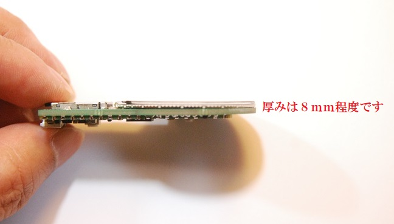

# RsPicoラウンド液晶モジュール

ラズベリーパイPicoを使用して1.28インチ240ｘ240ドットの円形液晶を駆動する基板モジュールです。

円形液晶の裏にラズベリーパイPicoを配置してしまいました。

ラズベリーパイPicoの大きさの分だけこの基板も大きくなってしまったので、メモリーカードスロットを乗せてみました。

おまけで、RUN信号によるリセットボタンとNeopixel（フルカラーLCD)を１個搭載しています。

円形液晶にはGC9A01というコントローラーが使用されていますが、対応したグラフィックライブラリが数種類公開されています。

本モジュールは「グラフィックライブラリの使い方を理解して液晶モジュールを駆動出来る人」をターゲットにしております。

# 注意！！（必ずお読み下さい）

本品は基本的な電子回路の仕組みを理解した方を対象とした、電子部品がむき出しの半完成キットです。
電子部品は電源電圧や極性を間違えたり、部品を破損させたり部品端子をショートさせた場合、発熱・発煙・発火に至る場合もあります。
間違った使い方をすると危険である事を理解された方のみご使用ください。
趣味の電子工作向けに製作しておりますので、製品への組込みや日常生活へ組込んでのご使用はお止め下さい。

# 形状および回路図

以下に外形イメージを示します

以下に回路図を示します

# ピンアサイン

ラズベリーパイPico とLCDの制御信号とのピン接続は以下となります。

- SCLK:GP18

- MOSI:GP19

- DC:GP11

- CS:GP13

- RST:GP12

- バックライト:GP10

  

ラズベリーパイPicoとメモリーカード制御信号とのピン接続は以下となります。

- SCLK:GP18（LCDと共通）
- MOSI:GP19（LCDと共通）
- CS:GP17

また、I2C接続などを想定した外部接続端子があります

注意：リード線をハンダ付けするパットとして使用します　コネクタやピンヘッダは挿せません。　

また、1PINおよび2PINはセンサーなど小型周辺モジュールを駆動するための電源出力端子です。本モジュールを駆動するための電源入力としては設計しておりません。

- 1PIN : 5V

- 2PIN : 3.3V

- 3PIN : GP4 (I2C SDAを想定)

- 4PIN : G9P5(I2C SCLを想定)

- 5PIN : GP0(UART TX0を想定)

- 6PIN : GP1(UART RX0を想定)

- 7PIN : GND 

 

# 使用するツールやライブラリ

CircuitPython　や　Arduino IDEでの動作を確認しています。
まず最初に以下のページでCircuitPythonのファームウェアをダウンロードしてラズベリーパイPicoに書き込んで下さい。

https://circuitpython.org/board/raspberry_pi_pico/

（書き込み操作を間違えたりプログラムの不具合で動かなくなった場合、ファームウェアを書き直してみてください）

ラズベリーパイPicoをArduino IDEで使用するためのインストールは、以下サイトを参考下さい。

https://github.com/earlephilhower/arduino-pico

以下、Arduino IDEで動作させる場合のサンプルコードです

https://github.com/urukakanko/RsPico_round_lcd/tree/main/RsPico_round_lcd_ClockSample

Arduino IDEでのグラフィックライブラリについては主にlovyan様のLovyanGFXにて動作確認をしています。

https://github.com/lovyan03/LovyanGFX

他、GC9A01に対応したライブラリが使用可能と考えています。

# LCD表示動画

https://youtu.be/9OK_MoBfMhk

# こちらもそーたメイ様のつくるっちに対応して頂きました

http://sohta02.web.fc2.com/familyday.html

対応ファームはコチラです。予めラズベリーパイPicoに.uf2ファイルを書込んでください。

https://github.com/urukakanko/RsPico_round_lcd/blob/main/src.ino.elf.uf2

Chromeブラウザで以下つくるっち画面を開き「拡張機能を追加」から「M5Series」を追加してください

https://sohta02.sakura.ne.jp/tukurutch/

サンプルプログラムは以下です

https://github.com/urukakanko/M5Stamp_round_lcd/blob/main/M5Stamp%E3%82%B5%E3%83%B3%E3%83%97%E3%83%AB_%E3%83%8F%E3%83%83%E3%83%94%E3%83%BC%E3%83%8F%E3%83%AD%E3%82%A6%E3%82%A3%E3%83%B3.sb3

# スイッチサイエンス　マーケットプレイスにて販売しています

https://www.switch-science.com/products/8432/

# 製作者

ウルカテクノロジー
Hiroyuki Sunagawa

https://www.facebook.com/URUKA-Technologies-105478404379918
